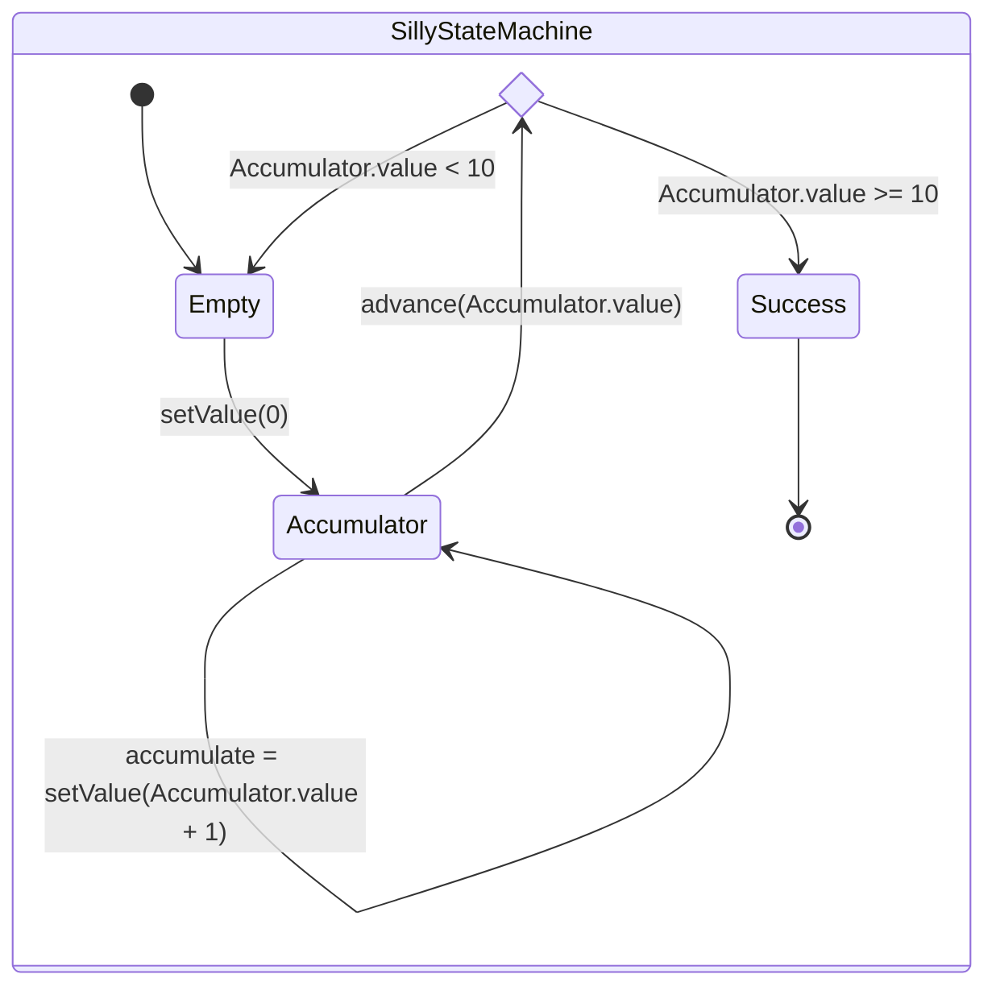

```mermaid
stateDiagram-v2

state SillyStateMachine {
  state AdvanceResult<<choice>>


  [*] --> Empty
  Empty --> Accumulator: setValue(0)

  Accumulator --> Accumulator: accumulate = setValue(Accumulator.value + 1)
  Accumulator --> AdvanceResult: advance(Accumulator.value)

  AdvanceResult --> Empty: Accumulator.value < 10
  AdvanceResult --> Success: Accumulator.value >= 10

  Success --> [*]

}
```
